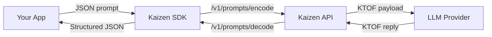

# Kaizen SDKs

[](python/pyproject.toml)
[](docs/sdk_reference.md)
[](openapi.json)
[](LICENSE)

Compress prompts, shrink latency, and decode large-model responses using the **Kaizen Token Optimized Format (KTOF)**. This repository hosts every official Kaizen client, starting with the Python SDK plus shared docs, schemas, and examples.

> **Status:** Python SDK is production-ready. JavaScript/TypeScript, Go, and CLI tooling are next up.

## Quick links

- [SDK Reference](docs/sdk_reference.md) – exhaustive endpoint + field guide (“Kaizen SDK Knowledge Transfer”).
- [Python package](python/README.md) – install, configure, and extend the current SDK.
- [Examples](python/examples/README.md) – OpenAI, Anthropic, and Gemini wrappers.
- [Architecture](docs/ARCHITECTURE.md) – repo layout and roadmap.

## Table of contents

1. [Why Kaizen?](#why-kaizen)
2. [How it works](#how-it-works)
3. [Repository layout](#repository-layout)
4. [Supported providers](#supported-providers)
5. [Getting started](#getting-started)
6. [Environment targets](#environment-targets)
7. [Usage patterns](#usage-patterns)
8. [API surface summary](#api-surface-summary)
9. [Documentation map](#documentation-map)
10. [FAQ](#faq)
11. [Support](#support)

## Why Kaizen?

- **Cut prompt spend:** KTOF compresses structured JSON/chat payloads before they hit LLM providers, reducing tokens and bytes.
- **Consistent ergonomics:** Every SDK mirrors the same OpenAPI schema, so you can swap languages or hosts without relearning the API.
- **Provider-ready helpers:** Drop-in decorators/wrappers automatically encode outbound prompts and decode responses for OpenAI, Anthropic, and Gemini.
- **Observability built in:** Every encode/optimize route returns stats (length deltas, token counts, metadata) so you can quantify savings.
- **Security conscious:** API keys flow through environment variables and bearer headers; no keys land in source control by default.

## How it works



1. Send structured prompts or free-form text to Kaizen.
2. KTOF encodes and optionally segments embedded JSON.
3. Pass the compact payload to your preferred LLM provider.
4. Decode the provider response back into structured JSON with preserved metadata.

## Repository layout

| Path | Description |
| ---- | ----------- |
| `python/` | Python SDK source, tests, examples, and packaging (`python/README.md`). |
| `docs/` | Architecture notes, SDK reference, and design records. |
| `openapi.json` | Canonical Kaizen HTTP schema consumed by every SDK. |
| `CODE_OF_CONDUCT.md`, `CONTRIBUTING.md`, `LICENSE` | Community policies and license. |

Future SDKs (e.g., `js/`, `go/`, `cli/`) will live alongside `python/` using the same pattern.

## Supported providers

| Provider | Helper | Notes |
| -------- | ------ | ----- |
| OpenAI | `kaizen_client.integrations.openai.OpenAIKaizenWrapper` | Wraps the Responses API, auto-encodes prompts before `responses.create`. |
| Anthropic | `kaizen_client.integrations.anthropic.AnthropicKaizenWrapper` | Compresses Claude prompts and decodes outputs. |
| Gemini | `kaizen_client.integrations.gemini.GeminiKaizenWrapper` | Works with Gemini 2.5 Flash via `google.generativeai`. |

Want another provider? Follow the existing wrappers as templates inside `python/kaizen_client/integrations/`.

## Getting started

1. **Clone & install**

    ```bash
    git clone https://github.com/getkaizen/kaizen-sdk.git
    cd kaizen-sdk/python
    uv pip install -e .[all]
    ```

2. **Request access** – Email `hello@getkaizen.ai` for a production API key.
3. **Configure env vars**

    ```bash
    export KAIZEN_API_KEY="kaizen_xxx"            # request via hello@getkaizen.ai
    export KAIZEN_TIMEOUT="30"                   # optional override
    export KAIZEN_BASE_URL="https://api.getkaizen.io/"  # override only if using staging/local
    ```

    > Tip: store secrets in a gitignored `.env` or secret manager. CI pipelines can inject them at runtime.

4. **Run the hello-world harness**

    ```bash
    python - <<'PY'
    import asyncio
    from kaizen_client import KaizenClient

    async def main():
        async with KaizenClient() as client:
            encoded = await client.prompts_encode({"prompt": {"messages": [{"role": "user", "content": "Compress me"}]}})
            decoded = await client.prompts_decode({"ktof": encoded["result"]})
            print(decoded["operation"], decoded["status"])

    asyncio.run(main())
    PY
    ```

5. **Explore examples** – Use the vendor walkthroughs in [`python/examples/README.md`](python/examples/README.md).

## Environment targets

- **Production (default):** `https://api.getkaizen.io/` – no action required unless you prefer explicit env vars.
- **Staging/Internal:** point `KAIZEN_BASE_URL` at your internal host (e.g., `https://internal.getkaizen.ai`).
- **Local development:** run the Kaizen service locally and set `KAIZEN_BASE_URL=http://127.0.0.1:8000`. Keep `KAIZEN_TIMEOUT` modest (≈30s) to surface connectivity issues quickly.

## Usage patterns

### Raw encode/decode

```python
from kaizen_client import KaizenClient

client = KaizenClient()
encoded = await client.compress({"data": {"messages": messages}})
decoded = await client.decompress({"data": encoded["result"]})
```

### Prompt optimizer + provider wrapper

```python
from kaizen_client import KaizenClient
from kaizen_client.integrations.openai import OpenAIKaizenWrapper

async with KaizenClient() as kaizen:
    wrapper = OpenAIKaizenWrapper(kaizen, model="gpt-4o-mini")
    response = await wrapper.chat(messages)
    print(response["decoded"]["result"])
```

### Stats & metadata

Every encode/optimize route returns:

- `stats` – original vs optimized lengths, reduction ratio, token deltas (when `token_models` provided).
- `meta` – auto-detection hints, schemas, and your echoed `metadata` for observability.

See [`docs/sdk_reference.md`](docs/sdk_reference.md) for the full envelope.

## API surface summary

| Method | Endpoint | Purpose |
| ------------- | -------- | ------- |
| `compress()` | `POST /v1/compress` | Encode arbitrary JSON to KTOF and emit size stats. |
| `decompress()` | `POST /v1/decompress` | Rehydrate KTOF strings back into JSON structures. |
| `optimize()` | `POST /v1/optimize` | Encode + compute token deltas in one call. |
| `optimize_request()` | `POST /v1/optimize/request` | Compress outbound provider requests (segments + telemetry). |
| `optimize_response()` | `POST /v1/optimize/response` | Decompress provider responses and compare byte lengths. |
| `prompts_encode()` | `POST /v1/prompts/encode` | Preferred prompt optimizer with schema hints + metadata replay. |
| `prompts_decode()` | `POST /v1/prompts/decode` | Decode prompts and merge replay metadata. |
| `health()` | `GET /` | Lightweight liveness probe.

## Documentation map

| Doc | What you’ll find |
| --- | ---------------- |
| [`docs/sdk_reference.md`](docs/sdk_reference.md) | Endpoint-by-endpoint contract, payload tables, and implementation nuances. |
| [`docs/ARCHITECTURE.md`](docs/ARCHITECTURE.md) | Repo structure, guiding principles, roadmap snapshot. |
| [`python/README.md`](python/README.md) | Python-specific installation, environment guidance, and helper docs. |
| [`python/examples/README.md`](python/examples/README.md) | How to run each provider walkthrough with real credentials. |
| [`CONTRIBUTING.md`](CONTRIBUTING.md) | Development workflow, testing expectations, release process. |

## FAQ

**Does the SDK require async?** – Yes, the Python client is fully async via `httpx.AsyncClient`. Wrap it with `asyncio.run` or use the provided decorator `with_kaizen_client` to manage the lifecycle.

**How do I request an API key?** – Email `hello@getkaizen.ai`. Keys are passed via `KAIZEN_API_KEY` or `KaizenClientConfig(api_key=...)`.

**Can I run Kaizen locally?** – Yes. Point `KAIZEN_BASE_URL` at your local FastAPI host (default `http://127.0.0.1:8000`). The SDK will use that base URL automatically.

**Where do stats/token numbers come from?** – The backend normalizes JSON, computes byte diffs, and (optionally) runs token counts per model. SDKs simply relay those numbers.

## Support

- **Issues & feature requests:** open a ticket in this repo and include reproduction steps or desired behavior.
- **Security reports:** email `security@getkaizen.ai` instead of filing a public issue.
- **General questions:** reach the engineering team at `hello@getkaizen.ai`.

PRs are welcome—see [`CONTRIBUTING.md`](CONTRIBUTING.md) and keep tests/docs alongside code changes.
