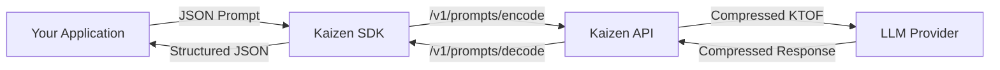

# Kaizen SDKs

  

Compress prompts, reduce latency, and decode large-model responses using the **Kaizen Token Optimized Format (KTOF)**. This repository hosts the official Kaizen clients—starting with Python—plus documentation, schemas, and usage examples.

> Status: The Python SDK is production-ready. JavaScript/TypeScript, Go, and CLI tooling are planned for upcoming releases.\
> Benchmark Program: Interested in evaluating prompt compression or latency optimization across LLM providers? Contact [**hello@getkaizen.ai**](mailto:hello@getkaizen.ai) to join the testing cohort.

---

## Quick Links

- [SDK Reference](docs/sdk_reference.md): Complete field guide and endpoint documentation
- [Python SDK](python/README.md): Installation, configuration, and customization
- [Examples](python/examples/README.md): Wrappers for OpenAI, Anthropic, and Gemini
- [Architecture](docs/ARCHITECTURE.md): High-level design and repository structure

---

## Table of Contents

 1. [Why Kaizen?](#why-kaizen)
 2. [How It Works](#how-it-works)
 3. [Repository Layout](#repository-layout)
 4. [Supported Providers](#supported-providers)
 5. [Getting Started](#getting-started)
 6. [Environment Targets](#environment-targets)
 7. [Usage Patterns](#usage-patterns)
 8. [API Surface Summary](#api-surface-summary)
 9. [Documentation Map](#documentation-map)
10. [FAQ](#faq)
11. [Support](#support)

---

## Why Kaizen?

- Reduce token usage and lower costs through compression of prompts and responses
- Consistent API surface across languages with OpenAPI-based SDKs
- Seamless wrappers for OpenAI, Anthropic, Gemini, and other LLM providers
- Transparent observability: track compression ratios, token savings, and metadata
- Multi-tenant SaaS and enterprise deployment options available

---

## How It Works

